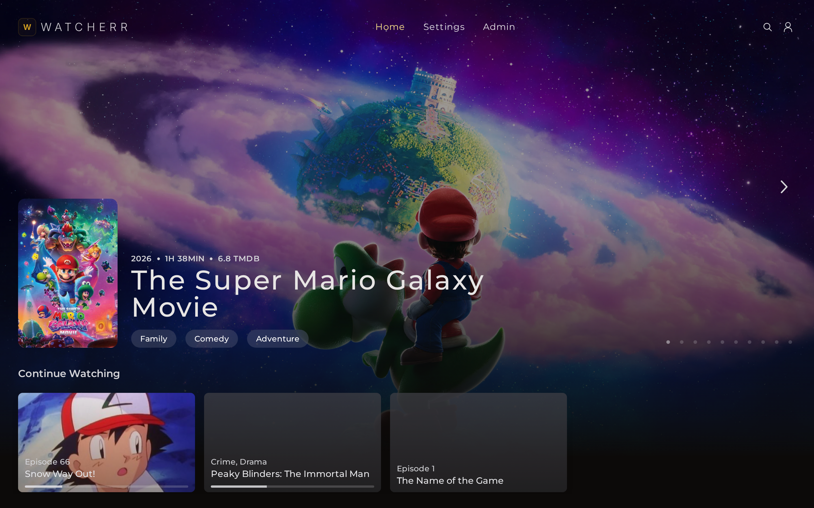
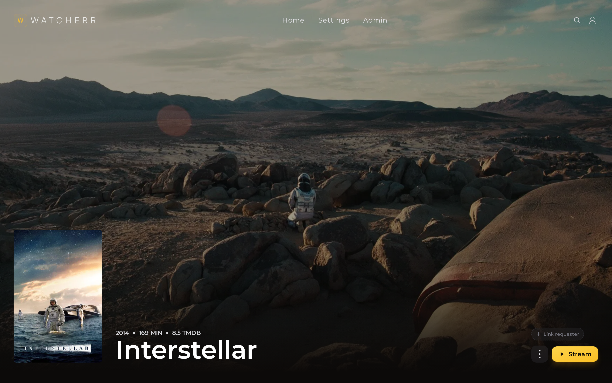
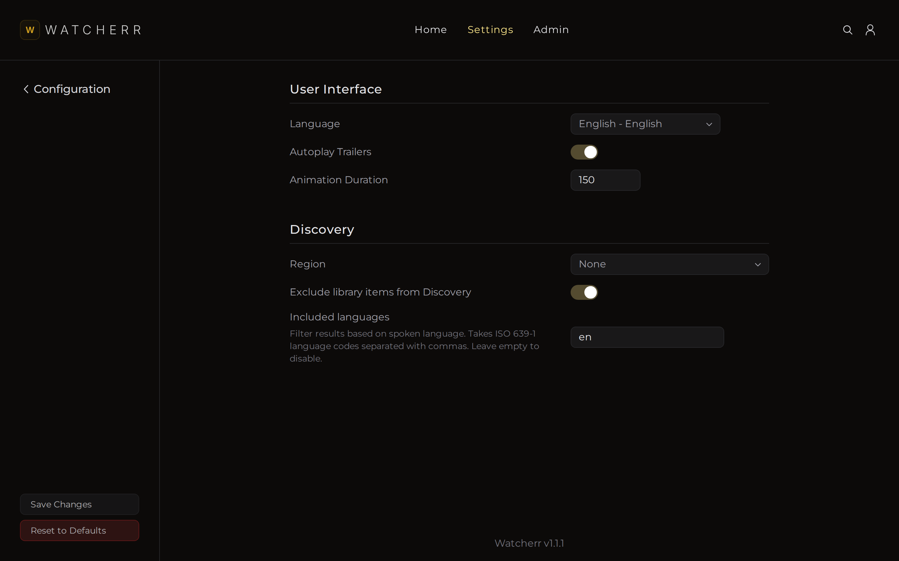
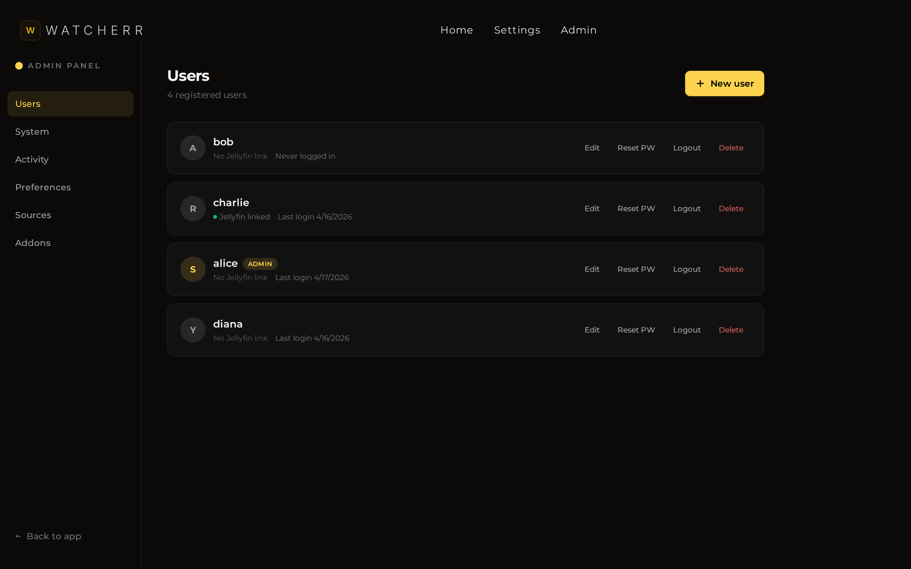
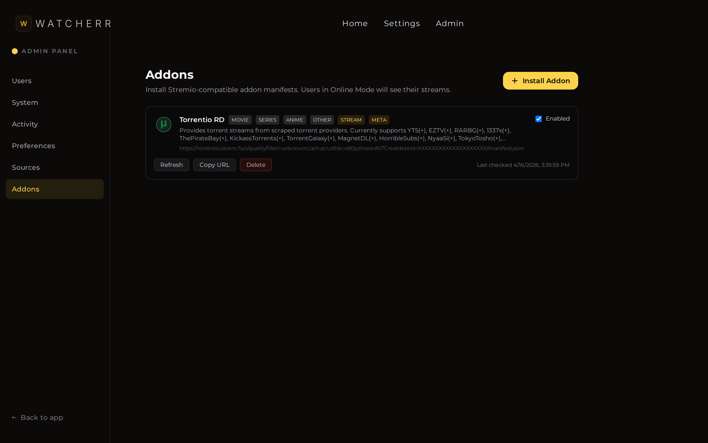
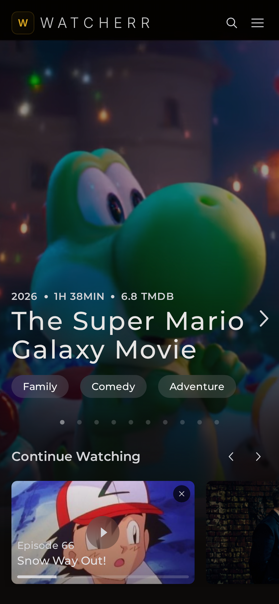
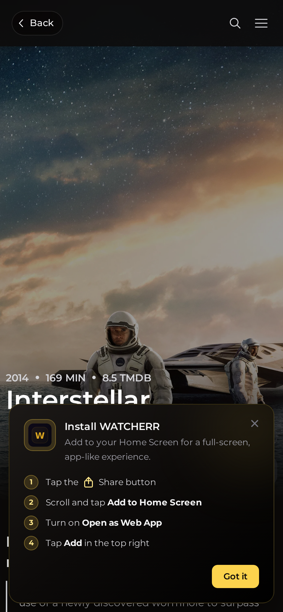
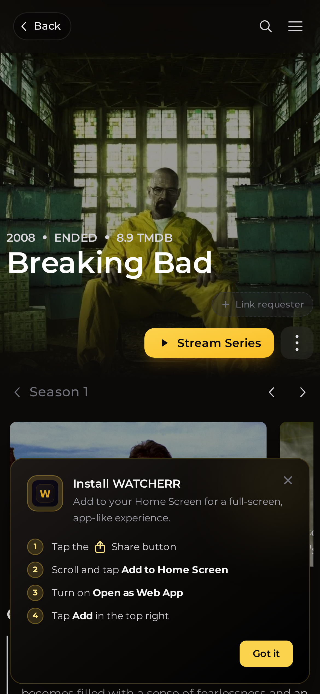

<div align="center">


**Your self-hosted media hub. Request, stream, and watch — all from one app.**


</div>

<p align="center">
  
</p>

---

## About

WATCHERR is a self-hosted, mobile-first media management app built for families and small groups. It connects to your existing media stack (Jellyfin, Sonarr, Radarr) and gives every user a clean, locked-down interface to browse, request, and stream content — without exposing your admin tools.

WATCHERR supports two distinct user modes:

- **Standard Mode** — for users with a full media server stack. Browse your library, request new movies and series with one tap, and track download progress in real time. Content is downloaded to your server via Sonarr/Radarr and played through Jellyfin.

- **Online Mode** — for users who just want to watch. Stream any movie or TV episode directly on your phone, tablet, or PC using Stremio addons and VLC. No downloads, no storage, no waiting. Just pick a stream and play.

Every user chooses their mode on first login. Admins manage everything — users, integrations, addons — from a built-in admin panel.

---

## ✨ Features

### Core

| 🔐 **Login-gated** | 📱 **Mobile-first PWA** | ⚡ **One-tap requests** |
|---|---|---|
| No public signup — admin creates every account. | Installable on iOS, Android, and desktop. Pull-to-refresh. Safe-area insets for notch/Dynamic Island. | Quality-profile picker built in. Request movies, seasons, or single episodes in one tap. |
| 👑 **Admin panel** | 🎯 **Smart indicators** | 🎬 **Jellyfin sync** |
| User CRUD, force-logout, activity log, and full system/integration config from the UI. | Upcoming release dates, download progress, stalled detection, "no releases" warnings. | Passwords stay synced between WATCHERR and Jellyfin automatically. |

### Online Mode — Stream Anything, Anywhere

Online mode turns WATCHERR into a streaming app. It uses **Stremio-compatible addons** to aggregate torrent streams from multiple sources and lets you play them instantly in VLC.

- **Stremio Addon Support** — Install any Stremio-compatible addon (Torrentio, MediaFusion, Comet, etc.) from the **Admin → Addons** page. WATCHERR queries all installed addons in parallel and merges the results into a single stream list.
- **Stream Aggregation** — Streams from all addons are normalized, deduplicated, and enriched with metadata: quality (4K, 1080p, 720p, 480p), file size, seeder count, audio/video codecs, and source name. Results are sorted by seeders by default.
- **VLC Playback** — Tap any stream to open it directly in VLC via the `vlc://` protocol. VLC handles all codecs natively — no transcoding, no buffering issues, no browser compatibility headaches. Works on iOS, Android, Windows, macOS, and Linux.
- **External Player Menu** — Every stream has a kebab menu with options to open in VLC, Infuse, Stremio, play in browser, or copy the URL to clipboard.
- **Episode Picker** — For TV series, a dedicated season/episode picker lets you browse all seasons with episode thumbnails, titles, runtimes, and air dates from TMDB. Pick any episode and instantly see available streams.
- **Back Navigation** — After picking an episode and viewing streams, a back button returns you to the episode picker so you can quickly move to the next episode.
- **Quality Filters** — Filter streams by quality (4K, 1080p, 720p) and search by title. Sort by quality, file size, or seeder count.
- **Subtitle Support** — When available, subtitles are fetched and passed along to VLC automatically.
- **No Request Buttons** — Online mode users don't see request/download buttons since they stream directly. The UI adapts to show only what's relevant.

### Standard Mode — Request and Download

Standard mode is the traditional media request workflow:

- **One-Tap Requests** — Hit the request button on any movie or series page. Choose a quality profile (e.g., 1080p, 4K) from the dropdown and WATCHERR sends the request to Sonarr or Radarr.
- **Download Progress** — Track download progress with a live progress bar. See percentage, download speed, and ETA. Stalled downloads are flagged automatically.
- **Library Integration** — Once downloaded, content appears as "Available in Library" with a direct link to Jellyfin.
- **Upcoming Awareness** — For unreleased content, WATCHERR shows release dates, "Awaiting release" banners, and "No releases yet" warnings so users know what to expect.
- **Season & Episode Requests** — Request entire seasons or individual episodes. Each episode card shows its download status independently.

### Splash Screen

On mobile and tablet, a polished splash screen with the WATCHERR logo greets you when you open the app. It plays once per session — navigating between pages won't trigger it again, but closing and reopening the app will.

### Mobile Experience

- **Safe Area Support** — Full support for iPhone notch, Dynamic Island, and home indicator. Content never hides behind system UI.
- **Back Navigation** — A clean back button pill appears on all non-home pages on mobile, with smooth press animation.
- **Pull to Refresh** — Pull down from the top of any page to refresh content.
- **PWA Installable** — Add to home screen on iOS Safari or install via Chrome on Android for a native app experience.

---

## 📸 Screenshots

| Home | Title Page | Series Page |
|---|---|---|
|  |  |  |

| Login | Admin Settings | Admin Users |
|---|---|---|
|  |  |  |

| Admin Addons |
|---|
|  |

| Mobile Home | Mobile Title | Mobile Series |
|---|---|---|
|  |  |  |

---

## 🚀 Quick Start

### Path A — Docker Compose (recommended)

```bash
git clone https://github.com/ggwp817/watcherr
cd watcherr
cp .env.example .env
# Edit .env and set JWT_SECRET to a long random string
docker compose up -d
```

Open <http://localhost:9494> and log in with `admin` / `changeme123`. **Change the password immediately.**

### Path B — Docker run (build the image first)

```bash
git clone https://github.com/ggwp817/watcherr
cd watcherr
docker build --target production -t watcherr:latest .
docker run -d \
  --name watcherr \
  -p 9494:9494 \
  -v ./config:/config \
  -e TZ=UTC \
  -e JWT_SECRET="$(openssl rand -hex 32)" \
  watcherr:latest
```

---

## ⚙️ First-Time Setup

### 1. Log in as admin


Default credentials: `admin` / `changeme123`.

### 2. Change your password

Open the profile menu (top-right on desktop, hamburger on mobile) → **Change Password**. Do this before anything else.

### 3. Connect your services

Go to **Admin → System**. Paste the base URL and API key for each of:

- **Sonarr** (default `http://127.0.0.1:8989`)
- **Radarr** (default `http://127.0.0.1:7878`)
- **Jellyfin** (default `http://127.0.0.1:8096`)
- **TMDB** — grab a read token at [themoviedb.org](https://www.themoviedb.org/settings/api)
- **Bazarr** (optional, for subtitles)


Click **Test Connection** on each card. Save when every card shows a green "Connected" badge.

### 4. Install Stremio Addons (for Online Mode)

Go to **Admin → Addons**. Add any Stremio-compatible addon by pasting its manifest URL. Popular options:

- **Torrentio** — the most popular Stremio addon for torrent streams
- **MediaFusion** — aggregates multiple torrent sources
- **Comet** — another torrent stream provider

WATCHERR queries all installed addons in parallel when a user opens the stream list, merging results into a unified view with quality badges, seeder counts, and file sizes.

### 5. Invite users

Go to **Admin → Users** → **New User**. Each user gets a username + initial password; they'll be prompted to change it on first login.

On first login, each user chooses their mode:

- **Standard** — full request/download workflow via Sonarr/Radarr/Jellyfin
- **Online** — stream directly via Stremio addons + VLC (requires VLC installed on their device)

Users can switch modes anytime from their profile page.


---

## 📱 Mobile

<p align="center">
  
  &nbsp;&nbsp;
  
  &nbsp;&nbsp;
  
</p>

WATCHERR is a PWA. On **iOS Safari**: Share → "Add to Home Screen". On **Android Chrome**: the install prompt appears automatically. Pull down from the top of any page to refresh.

**VLC is required for Online Mode.** Install VLC on your device before using the streaming features:
- [VLC for iOS](https://apps.apple.com/app/vlc-for-mobile/id650377962)
- [VLC for Android](https://play.google.com/store/apps/details?id=org.videolan.vlc)

---

## 🔧 Configuration

All configuration is done via environment variables (at container start) or via the Admin panel (anytime):

| Variable | Default | Description |
|----------|---------|-------------|
| `TZ` | `UTC` | Container timezone |
| `JWT_SECRET` | *(required)* | Signing secret for auth tokens. Generate with `openssl rand -hex 32`. Changing this invalidates all active sessions. |
| `DEFAULT_ADMIN_USER` | `admin` | Username of the seeded admin (only used if no admin exists) |
| `DEFAULT_ADMIN_PASS` | `changeme123` | Password of the seeded admin (only used if no admin exists) |
| `PORT` | `9494` | Port the app listens on inside the container |

All API keys (Sonarr, Radarr, Jellyfin, TMDB, Bazarr) are stored in the database and configured through the **Admin → System** page. They are not environment variables.

---

## 🌐 Reverse Proxy

<details>
<summary><strong>Caddy</strong></summary>

```
watch.example.com {
    reverse_proxy localhost:9494
}
```

</details>

<details>
<summary><strong>Nginx</strong></summary>

```nginx
server {
    listen 80;
    server_name watch.example.com;

    location / {
        proxy_pass http://127.0.0.1:9494;
        proxy_set_header Host $host;
        proxy_set_header X-Real-IP $remote_addr;
        proxy_set_header X-Forwarded-For $proxy_add_x_forwarded_for;
        proxy_set_header X-Forwarded-Proto $scheme;

        # Needed for SvelteKit streaming responses
        proxy_buffering off;
        proxy_http_version 1.1;
    }
}
```

</details>

---

## 🛠️ Build from Source (without Docker)

```bash
git clone https://github.com/ggwp817/watcherr
cd watcherr
npm install
npm run build
PORT=9494 NODE_ENV=production JWT_SECRET="$(openssl rand -hex 32)" node build/
```

Requires Node.js 18+.

---

## ❓ Troubleshooting

<details>
<summary><strong>Can't log in — "invalid credentials" with admin/changeme123</strong></summary>

Admin is only seeded on the first boot when the users table is empty. If you set `DEFAULT_ADMIN_USER` / `DEFAULT_ADMIN_PASS` in `.env`, those values were used instead. To reset: stop the container, delete `./config/watcherr.sqlite`, and start again.

</details>

<details>
<summary><strong>Integrations show "Disconnected"</strong></summary>

Test the URL from inside the container:

```bash
docker exec watcherr wget -qO- http://your-sonarr:8989/ping
```

If that fails, the base URL is unreachable from the container's network. Use host IPs (not `localhost`) unless WATCHERR is on the same Docker network as your *arrs.

</details>

<details>
<summary><strong>PWA install option doesn't appear on iOS</strong></summary>

Open WATCHERR in Safari (not in-app browsers or Chrome). Tap **Share → Add to Home Screen**. Chrome on iOS cannot install PWAs.

</details>

<details>
<summary><strong>Changed JWT_SECRET and everyone was logged out</strong></summary>

Expected. `JWT_SECRET` signs every session token — rotating it invalidates them all. Only rotate if you're responding to a leak.

</details>

<details>
<summary><strong>Streams not loading in Online Mode</strong></summary>

Make sure at least one Stremio addon is installed in **Admin → Addons**. If streams load but VLC doesn't open, ensure VLC is installed on your device. On iOS, VLC must be installed from the App Store for the `vlc://` protocol to work.

</details>

<details>
<summary><strong>No streams found for a title</strong></summary>

This depends on your installed addons and what content they index. Try adding more addons, or check that your existing addon URLs are still valid. Some addons require configuration (like a debrid API key) — configure them on the addon's own setup page before pasting the manifest URL into WATCHERR.

</details>

---

## 📄 License

[AGPL-3.0](LICENSE).
